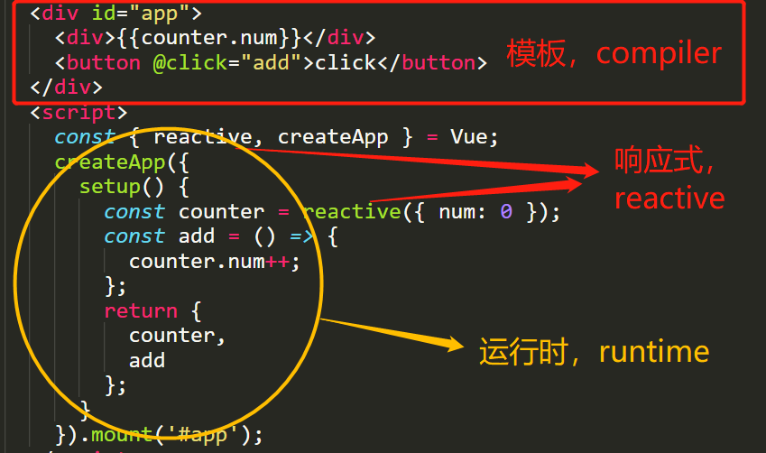

# reactive 模块

## 实现 mini-vue3+的目标

1. 与 vue3 源码结构尽量相同
2. 完整度要高，尽量能模拟 vue3 的真实流程
3. 能跑通 vue3 的一些基础用例
4. 用尽量少的代码实现，只做主线任务，跳过支线任务

## 熟悉 vue3 源码结构

项目目录参考[仓库](https://github.com/vuejs/core/tree/main/packages), 其中主要包含 3 大模块：`reactive`（响应式）、`runtime`（运行时）、`compiler`（编译器）。  
一个简单的示例：

```html
<template>
  <div id="app">
    <div>{{counter.num}}</div>
    <button @click="add">click</button>
  </div>
</template>
<script>
  const { reactive, createApp } = Vue;
  createApp({
    setup() {
      const counter = reactive({ num: 0 });
      const add = () => {
        counter.num++;
      };
      return {
        counter,
        add,
      };
    },
  }).mount('#app');
</script>
```



3 大模块中最重要就是`reactive`和 `runtime`，这 2 部分。如果熟悉渲染函数，可以使用渲染函数来写应用。  
在这里`template`的作用，就是将模板编译为渲染函数。了解这些基础后，我们代码的编写顺序就按照`reactive`-->`runtime`-->`compiler`的顺序完成`mini-vue`。

## reactive 的实现

#### 看下项目结构：

- webpack.config.js 目标是写一个库，将来会把库打包成`mini-vue.js`，输出到`dist`目录中
- examples 目录存放示例 html 代码，就像引用`vue.global.js`一样，引入`dist/mini-vue.js`，就可以工作了。

我们可以先试一下

```bash
npm run build
```

可以看到，`src/index.js`中的代码被打包进了`dist`目录中。那我们就启用

```bash
npm run dev
```

开始开发吧。

- 通过`vue3+\src\reactivity\reactive.js`和`vue3+\src\reactivity\effect.js`实现了对象（含数组）的`reactive`。

#### reactive 与 effect 是怎样建立联系的呢？

核心：进行依赖的收集`track`和触发更新`trigger`。 reactive 与 effect 建立联系进行 4 个步骤

1. 执行副作用函数
2. 执行过程中发现依赖，对响应式对象的依赖
3. 响应式对象中进行依赖收集
4. 响应式对象发生变化时触发更新


#### targetMap

用于储存副作用，并建立 响应式对象（依赖） ==> 副作用函数 的映射关系。  
一个副作用可能依赖多个响应式对象，也可能依赖一个响应式里的多个属性。  
而一个属性又可能被多个副作用依赖，因此 targetMap 的结构设计如下。

```javascript
{ // 这是一个WeakMap
  [target]: { // key是reactiveObject, value是一个Map
    [key]: [] // key是reactiveObject的键值, value是一个Set
  }
}
```

使用 WeakMap 的原因：当 reactiveObject 不再使用后，不必手动去 WeakMap 里删除，垃圾回收系统可以自动回收。

#### 特例处理

- 重复代理
- 不同值代理同一对象，应只代理一次
- 深层对象的代理
- 数组：处理数组长度变更
- 嵌套 effect：采用调用栈思想，解决 effect 的嵌套问题。

## ref 的实现

实现一个 ref 类，该类存在 2 个属性。\_\_isRef 标识当前对象是否为 ref，\_value 保存该对象的值。  
对于简单类型值，不做处理；对于复杂类型值转为响应式对象（可以收集对象依赖的副作用）。

## computed 的实现

computed 和 effect 比较像，但是有 2 点不同：

- effect 的副作用会立即执行 ，但 computed 不会
- computed 的依赖变量变化后，不会去执行 getter 函数，而是执行一个调度函数，在调度函数中置\_dirty 为 false
